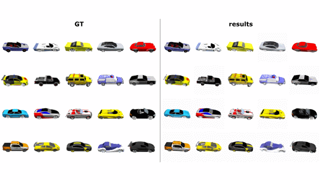

# Pixel-NeRF: Multi-View Stereo Enhanced
[](https://colab.research.google.com/github/JY-maru/pixelNeRF-SSU/blob/main/infer.ipynb)

본 프로젝트는 **Pixel-NeRF** (Yu et al., 2021)의 아키텍처를 기반으로, Multi-View Stereo(MVS) 개념(Variance 기반 정합성 판단)과 FPN(Feature Pyramid Network)을 도입하여 학습 효율과 기하학적 정확도를 극대화한 구현체입니다.

Colab 환경에서 약 30시간의 학습만으로 ShapeNet 차량 데이터셋에 대해 고품질의 3D 형상을 복원할 수 있도록 설계되었습니다. 적은 수의 Input 이미지로도 새로운 시점(Novel View)을 합성할 수 있는 Pixel-NeRF의 장점을 극대화하여, **자율주행 및 CV 분야의 차량 데이터 증강(Data Augmentation)** 파이프라인으로 활용할 수 있도록 객체의 디테일까지 구현될 수 있게 최적화 했습니다.

<br>

## 🎥 Demo Results

<p align="center">
  
</p>

<br>

---

## ⚡ Context & Optimization Strategy

본 프로젝트의 핵심 목표는 **자율주행(Autonomous Driving) 및 컴퓨터 비전(CV) 모델의 학습 데이터 확보를 위한 고품질 차량 데이터 증강** 입니다.

현실 세계에서 차량의 모든 각도 데이터를 수집하는 것은 막대한 비용이 소요됩니다. 본 프로젝트는 Google Colab 환경 내에서 Pixel-NeRF를 최적화하여, 소수의 차량 이미지(4-views)만으로도 정교한 3D 형상을 복원하고 다양한 각도의 **새로운 시점(Novel View)** 데이터를 생성해내며 화질 개선을 통해 데이터 증강 활용 가능성을 높이는 것을 목표로 합니다.

이를 위해 제한적인 컴퓨팅 자원 하에서도 최상의 기하학적 품질(Geometric Quality)을 확보하고자 다음과 같은 전략을 수립했습니다.

1.  **Efficient Geometric Learning (4-Views):** 제한적인 컴퓨팅 자원 내에서 빠른 수렴과 안정적인 결과 확보를 위해 **멀티뷰(4-Views)** 정보를 적극 활용했습니다. 이는 극한의 Few-shot 설정 대비 기하학적 모호성을 빠르게 해소하여, 짧은 학습 시간 내에서도 자율주행 데이터 증강에 필요한 신뢰할 수 있는 3D 형상을 복원합니다.
2.  **Resource Optimization:** 고사양 워크스테이션이 아닌 Colab 환경에서도 학습 및 렌더링이 원활하도록 모델을 경량화 및 최적화하여, 누구나 손쉽게 데이터 증강 파이프라인을 구축할 수 있도록 설계했습니다.

| 구분 | Original Pixel-NeRF | **Custom Model (Ours)** |
| :--- | :--- | :--- |
| **Objective** | General 3D Reconstruction | **Robust Vehicle Data Generation for CV** |
| **Input Views** | 1 ~ 2 Views (Sparse) | **4 Views (Geometric Constraints)** |
| **Environment** | Heavy Workstation | **Google Colab (Ready-to-Run)** |
| **Training Time** | 6 Days+ (V100) | **30 Hours (A100)** |
| **Focus** | Image Synthesis Quality | **Geometric Accuracy for CV Tasks** |


<br>

---
## 📂 Project Structure

```text
pixelNeRF-SSU/
├── config/               # Model 파라미터 설정 파일 (.yaml)
├── data/ 		          # 데이터 로더 및 필터링 로직
├── model/                # PixelNeRF, encoder 모듈 소스 코드
├── utils/                # Projection, 렌더링 관련 유틸리티 함수
├── train.py              # 학습용 소스코드 
├── inference.py          # novel-view 생성 관련 추론용 소스코드 
└── fetch2local.sh        # 데이터 다운로드 스크립트
```

## 📂 Dataset Details

본 프로젝트는 3D 객체 인식 및 복원 분야의 표준 벤치마크인 **ShapeNet Core V2** 데이터셋을 기반으로 합니다. 자율주행 환경 시뮬레이션이라는 목적에 맞춰, Cars 카테고리를 선별하여 학습을 진행합니다.

* **Dataset Source:** ShapeNet Core V2 (Cars Category)
* **Target Object:** Vehicles 
* **Data Format:** 각 3D 객체(Mesh)에 대해 사전 렌더링된 다각도 RGB 이미지와 Camera Pose 정보가 포함된 데이터를 사용합니다.

- 데이터 구조 예시
```
/<project-root>/data/shapeNetV2/
├── cars_train/
│   ├── <inst_id>/
│   │   ├── intrinsics.txt
│   │   ├── rgb/
│   │   │   ├── 000000.png
│   │   │   ├── 000001.png
│   │   │   └── ...
│   │   └── pose/
│   │       ├── 000000.txt
│   │       ├── 000001.txt
│   │       └── ...
│   └── ...
├── cars_val/
├── cars_test/
├── cars_train_val/
└── cars_train_test/
```

- 폴더 세부 내용
```
inst_id/
├── intrinsics.txt
├── intrinsics/   # (Optional) Per-image intrinsics
├── pose/         # Camera Extrinsics (C2W)
└── rgb/          # Rendered Images
```

<br>

---

## 🏗️ Model Architecture & Pipeline

단순히 뷰 개수만 늘린 것이 아니라, 늘어난 정보를 효과적으로 처리하기 위해 모델 아키텍처를 **Stereo Matching**에 적합한 구조로 고도화했습니다. 전체 파이프라인은 아래의 순서로 진행됩니다.

### 1. Multi-Scale Feature Extraction (FPN)
기존 ResNet의 단일 레이어 특징맵만 사용할 경우 발생하는 정보 손실을 막기 위해 **FPN(Feature Pyramid Network)** 을 도입했습니다.

<p align="center">
  
</p>


* **구조:** ResNet Backbone을 통해 4가지 해상도의 특징맵과 원본 RGB를 추출합니다.
* **효과:** Global Shape(저해상도)와 Fine Detail(고해상도)을 동시에 학습하여 디테일한 복원이 가능합니다.

### 2. World-to-Pixel Projection & Feature Fetching
타겟 뷰의 픽셀에 대응하는 3D 좌표를 소스 뷰로 투영하여 특징을 추출하는 과정입니다.

<p align="center">
  
</p>

* Target Ray 위의 3D 샘플 포인트들을 Source View의 2D 평면으로 투영(Projection)합니다.
* 투영된 위치에서 FPN으로 추출한 Multi-scale Feature를 가져옵니다(Bilinear Interpolation).

### 3. Early Fusion with Variance (Stereo Cue)
여러 뷰에서 가져온 특징들을 합치는 과정에서, 단순 평균(Average) 뿐만 아니라 **분산(Variance)** 정보를 활용합니다.

<p align="center">
  
</p>

* **기존(Average Only):** 뷰 간의 차이 정보가 희석되어 3D 구조 파악이 어려움.
* **제안(Average + Variance):** 이 때 Variance(분산)은 여러 카메라가 동일한 색상/특징을 보고 있는가를 나타내는 지표입니다.
    * **Low Variance:** 표면(Surface)일 확률 높음 (Stereo Cue).
    * **High Variance:** 허공이거나 가려진(Occluded) 영역.

### 4. Volume Rendering Pipeline
추출된 특징들은 Coarse/Fine MLP를 거쳐 밀도($\sigma$)와 색상($c$)으로 변환되며, 이를 **Volume Rendering** 적분을 통해 최종 픽셀 색상으로 합성합니다.

<p align="center">
  
</p>

최종 픽셀의 색상 $\hat{C}$는 광선(Ray) 상의 모든 샘플 포인트의 기여도를 합산하여 계산됩니다.


$$
\hat{C} = \sum_{i} \underbrace{T_i}_{\text{도달 확률}} \cdot \underbrace{(1 - e^{-\sigma_i \delta_i})}_{\text{현재 구간의 불투명도}} \cdot \underbrace{c_i}_{\text{색상}}
$$


* **$T_i$ (도달 확률):** 광선이 $i$번째 지점까지 장애물 없이 도달할 확률 (Transmittance).
* **$(1 - e^{-\sigma_i \delta_i})$ (불투명도):** 해당 구간($\delta_i$)에서 입자가 존재하여 광선이 부딪힐 확률.
* **$c_i$ (색상):** 해당 지점의 RGB 색상.

### 5. Training Strategy (Coarse-to-Fine)
렌더링된 이미지는 Ground Truth(GT) 이미지와 비교되어 학습됩니다.

<p align="center">
  
</p>

* **Coarse Pass:** 전체 영역을 균일하게 샘플링하여 대략적인 형상을 파악.
* **Fine Pass:** Coarse 단계에서 물체가 있을 확률이 높은 곳을 집중적으로 샘플링(Importance Sampling)하여 디테일 보정.
* **Loss:** Coarse와 Fine 출력 모두에 대해 MSE Loss를 계산하여 Backpropagation을 수행합니다.

<br>

---

## 📊 Model Performance

본 모델은 제한된 컴퓨팅 환경(Google Colab A100)에서 약 30시간(120k steps) 동안 학습을 수행하였습니다. 4-View Geometric Constraints를 적용한 결과, $256 \times 256$ 해상도 설정에서 PSNR 24.50 dB, SSIM 0.9649를 기록했습니다. 이는 휠, 사이드미러 등 차량의 세부 형상이 보존되었음을 나타내며, 개선된 디테일을 확인할 수 있습니다.

| Input Views | Resolution | Training Steps | PSNR (dB) | SSIM |
| :---: | :---: | :---: | :---: | :---: |
| 4 Views | $128 \times 128$ | 120,000 | 21.30 | 0.9523 |
| **4 Views** | **$256 \times 256$** | **120,000** | **24.50** | **0.9649** |

<br>

---

## 🚀 Getting Started

이 코드는 **Google Colab** 환경에 최적화되어 있습니다. 데이터 로드부터 학습까지 간편하게 실행 가능합니다.

### 1. Data Loading


-  **Option A. Google Drive 공유 폴더 이용 (권장)**

1.  **[ShapeNet Cars Dataset](https://drive.google.com/drive/folders/16oQiOyoA_9nHSqFn-jom9AJrChN2iMZV?usp=sharing)** 에 접속합니다.
2.  자신의 드라이브에 추가한 뒤,  데이터 경로(`config` )를 저장된 경로로 지정하여 사용하면 됩니다.

-  **Option B. 쉘 스크립트 이용**

스토리지에 등록된 사용자라면 별도의 다운로드 스크립트를 통해 데이터를 곧바로 로드할 수 있습니다.

```bash
# Colab 셀에서 실행
!bash fetch2local.sh -from nerf-data-ssu/shapeNetV2_cars
```

### 2. Training
최초 실행 시 기하학적 필터링을 위한 캐시(.pt) 생성으로 인해 시작에 약 5~10분이 소요될 수 있습니다. (학습 시 A100 권장)

> **Argv Guide**
 - `config/default_config.yaml` 파일에서 주요 학습 파라미터를 수정할 수 있습니다.
 - `-- resume` : 설정한 가중치부터 학습 재개
 - `-- config`: 지정한 config파일로 학습 (\[DEFAULT\] config/default_config.yaml)

```bash
 python train.py --config config/default_config.yaml
```

### 3. Inference (Video Generation)

> **Argv Guide**
 - `--mode` : views(novel-veiws 생성) or video(360도 view에 대한 영상)
 - `--size`: 모델 해상도 지정 (config의 학습된 가중치 해상도와 일치 필요)
- `--num_frames`: 생성 이미지 수 

```bash
!python -u inference.py --input_folder <INPUT_ROOT> \
                        --mode video \					
                        --output_dir ./outputs \
                        --size 256 \
                        --num_frames 120 \
                        --obj_id <selected_obj_id> \
                        --n_fine 256
```

<br>

---


## 📜 Acknowledgement & Citation

This project builds upon the official implementation of [PixelNeRF](https://github.com/sxyu/pixel-nerf) . We optimized it for constrained environments (Colab) by introducing FPN encoders, Variance-based feature aggregation, and Geometric data pruning.

If you use this code for your research, please cite the original Pixel-NeRF paper:

```bibtex
@inproceedings{yu2021pixelnerf,
  title={pixelNeRF: Neural Radiance Fields from One or Few Images},
  author={Yu, Alex and Ye, Vickie and Tancik, Matthew and Kanazawa, Angjoo},
  booktitle={CVPR},
  year={2021}
}
```

> License
This project is released under the MIT License.
